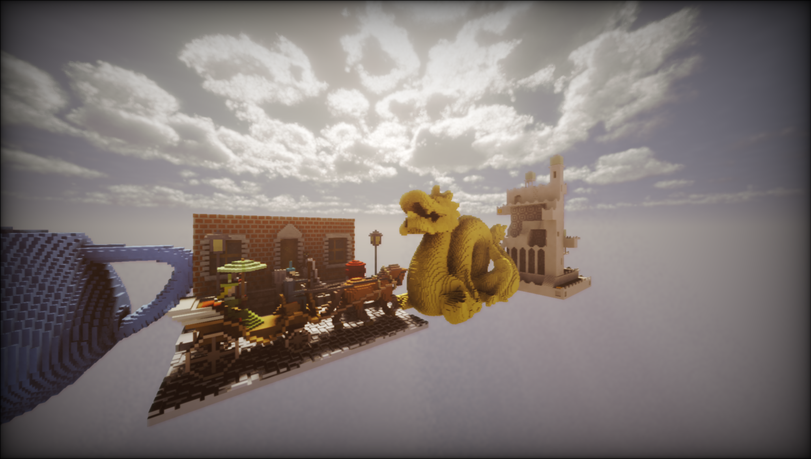

[Deployed Demo](https://dj24.github.io/soulflame-webgpu/)

[Docs](https://dj24.github.io/soulflame-webgpu/docs/)



## Getting Started

After cloning the repo run `npm install`, followed by `npm run serve` to start the development server on `localhost:8080`.

## Project Structure

### Asset Workflow
Currently, only `.vxm` ([VoxEdit](https://www.sandbox.game/en/create/vox-edit/)) files are supported. `.vox` ([MagicaVoxel](https://ephtracy.github.io/)) support is planned.

1. Add `.vxm` files to the public directory.
2. Get this file as an `ArrayBuffer`, via a fetch request or similar 
```typescript
const response = await fetch('path/to/file.vxm');
const voxelsArrayBuffer = await response.arrayBuffer();
```
3. Convert the `ArrayBuffer` to an object of `TVoxels` type via [`convertVxm`](src/convert-vxm.ts)
```typescript
const voxels = convertVxm(voxelsArrayBuffer);
```
5. Create a [GPUTexture](https://developer.mozilla.org/en-US/docs/Web/API/GPUTexture) using [`createTextureFromVoxels`](src/create-texture-from-voxels.ts)
```typescript
const voxelTexture = createTextureFromVoxels(device, voxels);
```
6. Add the texture to a [`VolumeAtlas`](src/volume-atlas.ts) 
```typescript
volumeAtlas.addVolume(voxelTexture);
```

### Volume Atlas
The `VolumeAtlas` class is a container for multiple 3D textures. It is used to store all the voxel models in the scene.

This means that only one texture binding is required for all the voxel models in the scene, which is useful especially for scenarios requires ray tracing of the scene. This also reduces the memory footprint for repeated instances of objects

Currently, textures are packed along the x-axis of the atlas. This means that the maximum number of textures that can be stored in the atlas is limited by the maximum texture size supported by the GPU.
In future, the atlas will be able to store textures in a 3D grid, allowing for more textures to be stored.
### Render Loop
TODO

## Rendering
Soulflame uses a deferred WebGPU renderer to render voxel models. Ray tracing is used to render the scene.

### GBuffer Layout
TODO

## Audio
TODO