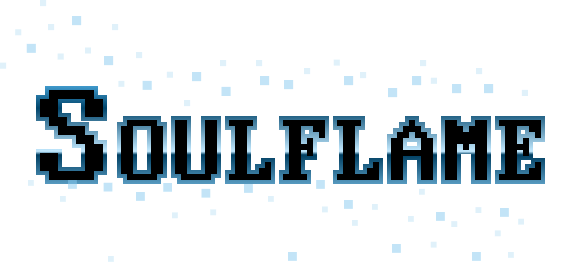

---

[Deployed Demo](https://dj24.github.io/soulflame-webgpu/)

[Docs](https://dj24.github.io/soulflame-webgpu/docs/)

---

## Getting Started

After cloning the repo run `npm install`, followed by `npm run serve` to start the development server on `localhost:8080`.

---

## Project Structure

### Asset Workflow
Currently, only `.vxm` ([VoxEdit](https://www.sandbox.game/en/create/vox-edit/)) files are supported. `.vox` ([MagicaVoxel](https://ephtracy.github.io/)) support is planned.

1. Add `.vxm` files to the public directory.
2. Get this file via a fetch request or similar
3. Get the `ArrayBuffer` of the response
4. Convert the `ArrayBuffer` to an object of `TVoxels` type via [`convertVxm`](src/convert-vxm.ts)
5. Create a [GPUTexture](https://developer.mozilla.org/en-US/docs/Web/API/GPUTexture) using [`createTextureFromVoxels`](src/create-texture-from-voxels.ts)
6. Add the texture to the VolumeAtlas

### Render Loop
TODO

---